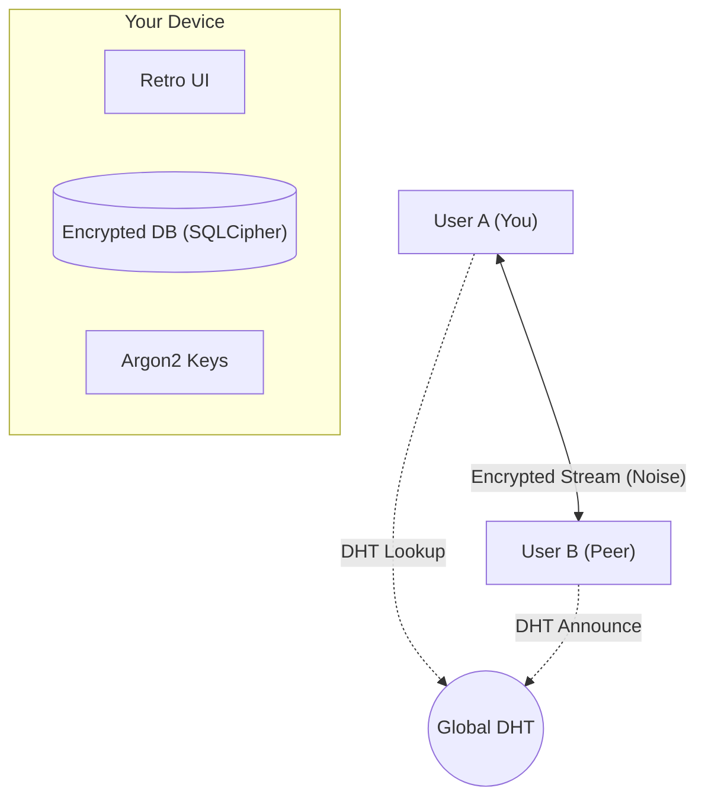

# ShellChat 🐚💬

[](https://goreportcard.com/report/github.com/nishal21/shellchat)
[](https://opensource.org/licenses/MIT)
[](https://github.com/nishal21/shellchat/releases)
[](https://github.com/nishal21/shellchat/actions)

> **The Retro-Futuristic, Serverless P2P Chat Application.**  
> *Encryption. Anonymity. Aesthetics.*

<p align="center">
  
</p>

## 🌟 Introduction

**ShellChat** is a terminal-based (and mobile-ready) decentralized chat application designed for the modern hacker. It operates **completely serverless**, using **Kademlia DHT** for global peer discovery and **libp2p** for encrypted, direct communication.

Whether you're on a Linux VPS, a Windows gaming rig, or an Android phone, ShellChat connects you directly to your peers with **zero metadata retention**.

---

## ✨ Features

### 🛡️ Unbreakable Security
-   **End-to-End Encryption**: All traffic is encrypted using TLS 1.3 / Noise.
-   **At-Rest Encryption**: Your local database is a **SQLCipher** vault, locked with **AES-256**.
-   **Key Derivation**: We use **Argon2id** (the winner of the Password Hashing Competition) to turn your password into a cryptographic key.

### 🌍 True Serverless P2P
-   **Global DHT**: We use the IPFS public DHT infrastructure to find peers worldwide without central servers.
-   **NAT Traversal**: Built-in **AutoNAT** and **UPnP** to punch through home routers and firewalls.
-   **Multi-Platform**: Runs natively on **Windows**, **Linux**, **macOS**, **Android**, and **iOS**.

### 🎨 Cyberpunk Aesthetics
-   **TUI (Desktop)**: A Split-Pane Terminal UI tailored for keyboard power users.
-   **GUI (Mobile)**: A touch-friendly interface that retains the retro-terminal feel.

---

## 🏗️ Architecture

How does ShellChat connect you without a server?



1.  **Bootstrap**: Your node connects to the global P2P network.
2.  **Announce**: You cryptographically sign your presence and announce it to the DHT.
3.  **Discover**: You search for a peer's ID (e.g., `QmHash...`).
4.  **Connect**: ShellChat establishes a direct TCP/QUIC connection.
5.  **Chat**: Messages flow directly between devices. No middleman.

---

## 🚀 Installation

### 📥 Binary Releases
Grab the latest release for your OS from the [Releases Page](https://github.com/nishal21/shellchat/releases).

| Platform | File |
| :--- | :--- |
| **Windows** | `shellchat-windows-amd64.exe` |
| **Linux** | `shellchat-linux-amd64.tar.xz` |
| **Android** | `shellchat-android.apk` |
| **macOS** | `shellchat-macos-universal` |

### 🔨 Build from Source

**Prerequisites**: Go 1.25+, GCC.

```bash
# Clone the repository
git clone https://github.com/nishal21/shellchat.git
cd shellchat

# Build TUI (Desktop)
go build -o shellchat .

# Build GUI (Mobile/Desktop)
go install fyne.io/fyne/v2/cmd/fyne@latest
fyne package -os windows -icon assets/icon.png --appID com.shellchat.app
```

---

## 🎮 Usage

### Quick Start
1.  **Launch**: Run `./shellchat chat`.
2.  **Login**: Set a master password (don't lose this!).
3.  **Connect**:
    -   Wait ~30s for Global DHT bootstrap.
    -   Type `/myid` to see your address.
    -   Type `/connect <peer-multiaddr>` to connect to a friend.

### Commands
| Command | Description |
| :--- | :--- |
| `/help` | Show all available commands |
| `/myid` | Display your full P2P MultiAddress |
| `/copyid` | Copy your address to clipboard |
| `/connect <addr>` | Connect to a remote peer |
| `/exit` | Leave current chat context |
| `/clear` | Clear screen buffer |
| `/quit` | Exit application |

---

## 🗺️ Roadmap

- [x] Global P2P Discovery
- [x] Android & iOS Support
- [x] Encrypted Local Storage
- [ ] **File Sharing**: P2P encrypted file transfer.
- [ ] **Group Chats**: Decentralized mesh groups.
- [ ] **Voice/Video**: WebRTC integration.

---

## 🤝 Contributing

We love contributions! Please read our [CONTRIBUTING.md](CONTRIBUTING.md) to get started.

## 🛡️ Security

Found a vulnerability? Please contact **nishalamv@gmail.com** or read our [SECURITY.md](SECURITY.md) policy.

## 📜 License

Distributed under the MIT License. See [LICENSE](LICENSE) for more information.

---
*Built with ❤️ by [Nishal](https://github.com/nishal21).*
